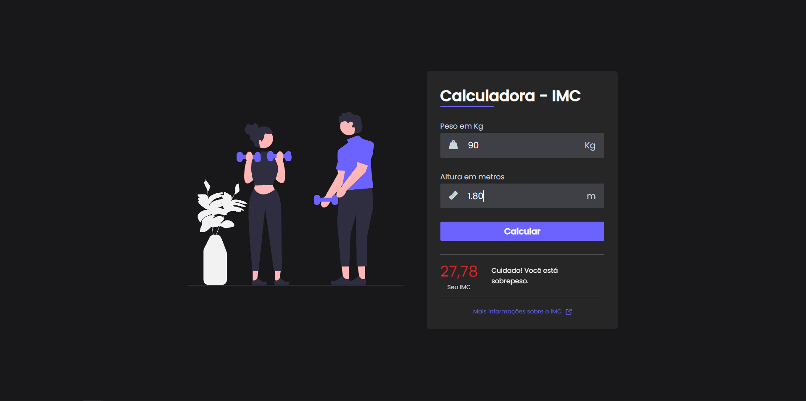

## Visão Geral

### O projeto

- Criar uma calculadora de IMC (Índice de massa corporal)

### Screenshot

### Links

- Live Site URL: [Calculadora IMC](https://calculadora-imc-ten-dun.vercel.app/)

## Meu processo

### Criado com

- HTML
- CSS
- JavaScript

### O que eu aprendi

- Manipulação do DOM

## Autor

- GitHub - [João Metzdorf](https://github.com/joaometzdorf)
